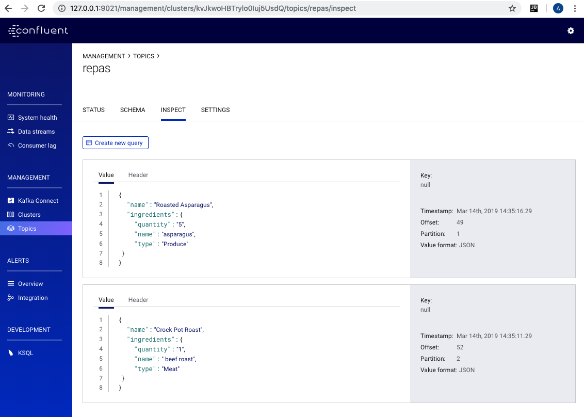

# KAFKACAT 

```
$ cd ../../1.KafkaCat/ 300089781  
$ docker-compose up -d 
$ docker network ls
$ docker run --tty --network 300089781_default confluentinc/cp-kafkacat kafkacat -b kafka:29092 -L
```
### Accèder à Kafka bash

```
$ docker-compose exec kafka bash 
```
### Faire la création des topics
```
root@kafka:/# kafka-topics --zookeeper zookeeper:32181 --topic repas --create --partitions 3 --replication-factor 1
Created topic "repas"
```
```
root@kafka:/# kafka-topics --zookeeper zookeeper:32181 --topic client --create --partitions 3 --replication-factor 1
Created topic "client"
```
### Sortir de kafka pour aller changer les fichiers séparemment, par exemple:
```
$ nano repas1.json
```
```
{"name": "Crock Pot Roast","ingredients": [{"quantity": "1","name": " beef roast","type": "Meat"}}
```
```
$ nano client.json
```
```
{"client": "Jo", "aime": {"quantity": 1, "name": "Crock Pot Roast"}}
{"client": "Jess", "aime": {"quantity": 1, "name": "Roasted Asparagus"}}
{"client": "Jane", "aime": {"quantity": -1, "name": "Chicken salad"}}
...
```
### Entrer dans ksql:
```
$ docker-compose exec ksql-cli ksql http://ksql-server:8088
```

## Sur le 1er terminal, partir le jeu SH.JEU1.SH et sur 2e terminal, tester :

```
(1er terminal)
toronto:300089781 ameliedubois$ sh jeu1.sh
Client
>>>>>>>>>>>>
```
```
(2e terminal)
ksql> SELECT * FROM client;
1552585858177 | null | Jo | {QUANTITY=1, NAME=Crock Pot Roast}
1552585862330 | null | Jess | {QUANTITY=1, NAME=Roasted Asparagus}
1552585866496 | null | Jane | {QUANTITY=-1, NAME=Chicken salad}
1552585872980 | null | Jo | {QUANTITY=1, NAME=Crock Pot Roast}
...
```
```
ksql> select client, aime->QUANTITY,aime->NAME from client;
Jo | 1 | Crock Pot Roast
Jess | 1 | Roasted Asparagus
Jane | -1 | Chicken salad
Jo | 1 | Crock Pot Roast
Jess | 1 | Roasted Asparagus
Jane | -1 | Chicken salad
Jo | 1 | Crock Pot Roast
Jane | -1 | Chicken salad
Jo | 1 | Crock Pot Roast
Jane | -1 | Chicken salad
Jane | -1 | Chicken salad
Jo | 1 | Crock Pot Roast
...
```
### Création d'une table 'client'
```
ksql> CREATE TABLE client \
>      (client STRING, \
>       aime STRUCT< \
>       quantity BIGINT, \
>       name STRING>) \
>    WITH (KAFKA_TOPIC='client', VALUE_FORMAT='JSON', KEY='aime');


 Message       
---------------
 Table created 
---------------
ksql> show tables;

 Table Name | Kafka Topic | Format | Windowed 
----------------------------------------------
 CLIENT     | client      | JSON   | false    
----------------------------------------------
```
### Créer le stream 'repas'
```
ksql> CREATE STREAM repas \
      (name STRING, \
       client STRING, \
       eta BIGINT, \
       ingredients STRUCT< \
       quantity BIGINT, \
       name STRING, \
       type STRING>) \
    WITH (KAFKA_TOPIC='repas', VALUE_FORMAT='JSON') 
    ```
	
 Message        
----------------
 Stream created 
----------------    
```    
### Creer un nouveau Stream du topic ksql_repas pour ensuite faire la creation d'un autre stream ayant un KEY
```
ksql>   CREATE STREAM ksql_repas (name STRING, \
                          client STRING, \
                          eta BIGINT, \
                          ingredients STRUCT< \
			  quantity BIGINT, \
			  name STRING, \
			  type STRING>) \
                    WITH (VALUE_FORMAT='JSON', \
                          KAFKA_TOPIC='repas');
 Message        
----------------
 Stream created 
----------------    
    
ksql>  CREATE STREAM ksql_repas_key \
    WITH (VALUE_FORMAT='AVRO', \
    KAFKA_TOPIC='repas_with_key') AS \
          SELECT name, client, eta, ingredients->quantity, ingredients->name, ingredients->type \
                FROM ksql_repas PARTITION BY client;
```
## Tester le jeu dans les 2 terminals:
```
(1er terminal)
ksql> select * from repas;
1553191266415 | null | Roasted Asparagus | Jess | null | {QUANTITY=5, NAME=asparagus, TYPE=Produce}
1553191266422 | null | French toast | Johnny | 1553970944 | {QUANTITY=1, NAME=breakfast, TYPE=bread}
1553191271821 | null | Crock Pot Roast | Jo | 1553279744 | {QUANTITY=1, NAME= beef roast, TYPE=Meat}
1553191275905 | null | Roasted Asparagus | Jess | 1553711744 | {QUANTITY=5, NAME=asparagus, TYPE=Produce}
1553191279736 | null | Chicken salad | Jane | 1553798144 | {QUANTITY=3, NAME=skinless, boneless chicken breasts, TYPE=Meat}
1553191283758 | null | Mac N Cheese | Jack | 1553884544 | {QUANTITY=2, NAME=mac n cheese, TYPE=pasta}
```
```
(2e terminal)
toronto:300089781 ameliedubois$ sh jeu.sh
foodie
>>>>>>>>>>>>>>>>>>>>>>>>>>>>
```
## Regarder le jeu marcher sur Control Center (127.0.0.1:9021)

## Si Control Center ne fonctionne pas, utiliser kafka consumer:
```
root@kafka:/# kafka-console-consumer --bootstrap-server kafka:9092 --topic repas
```

### inner join problem...
```
ksql> describe repas;

Name                 : REPAS
 Field       | Type                                                                
-----------------------------------------------------------------------------------
 ROWTIME     | BIGINT           (system)                                           
 ROWKEY      | VARCHAR(STRING)  (system)                                           
 NAME        | VARCHAR(STRING)                                                     
 CLIENT      | VARCHAR(STRING)                                                     
 ETA         | BIGINT                                                              
 INGREDIENTS | STRUCT<QUANTITY BIGINT, NAME VARCHAR(STRING), TYPE VARCHAR(STRING)> 
-----------------------------------------------------------------------------------
For runtime statistics and query details run: DESCRIBE EXTENDED <Stream,Table>;
ksql> describe client;

Name                 : CLIENT
 Field   | Type                                          
---------------------------------------------------------
 ROWTIME | BIGINT           (system)                     
 ROWKEY  | VARCHAR(STRING)  (system)                     
 CLIENT  | VARCHAR(STRING)                               
 AIME    | STRUCT<QUANTITY BIGINT, NAME VARCHAR(STRING)> 
---------------------------------------------------------
For runtime statistics and query details run: DESCRIBE EXTENDED <Stream,Table>;
ksql> SELECT * FROM repas INNER JOIN client ON client;
Failed to prepare statement: Field CLIENT is ambiguous.
Caused by: Field CLIENT is ambiguous.
ksql> SELECT * FROM repas INNER JOIN client ON client.client=repas.client;
Source table (CLIENT) key column (AIME) is not the column used in the join criteria (CLIENT).
ksql> SELECT * FROM client INNER JOIN repas ON client.client=repas.client;
Join between invalid operands requested: left type: KTABLE, right type: KSTREAM
```
