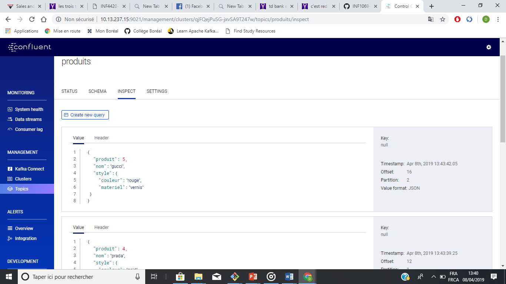
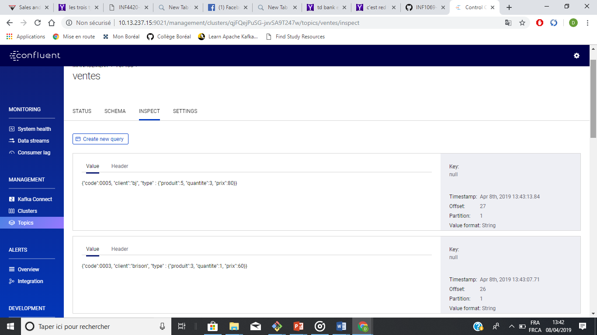

### ⭕️ PROJECT KAFKA_KSQL

## 1. CRÉER SON ENVIRONNEMENT DANS UN REPERTOIRE:
  ```  cp ../../D.Demo/docker-compose.yml  .``` 
 
 ##  2. Enlever les applications de la vente
  
  ```vi docker-compose.yml```
  
## 3. Avant de l'executer dans 1.Kafkacat/ID vous devez supprimer votre environnemnet dans D.Demo

 ```
$ cd Developer/INF1069-202-19H-02/1.KafkaCat/300093216
$ Owner@LAPTOP-D4NC7D4D MINGW64 ~/Developer/INF1069-202-19H-02/1.KafkaCat/300093216 (master)
$ docker-compose stop 
$ docker-compose rm 
```
## A . Executez votre environnement dans 1.KafkaCat/ID :

```
$ cd ../../1.KafkaCat/300093216
$ docker-compose up -d 
```
## 1. Connaitre le nom de switch Docker de KafkaCat
```
docker network ls
```
## 2. Faire la liste de tout l'environnment
```
docker run --tty --network 300093216_default confluentinc/cp-kafkacat kafkacat -b kafka:29092 -L
```
## 3. Accedez a votre bash de Kafaka
```
docker-compose exec kafka bash 
```

## 4. Création des topics
```
root@kafka:/# kafka-topics --zookeeper zookeeper:32181 --topic produits --create --partitions 4 --replication-factor 1
Created topic "produits"
```

```
root@kafka:/# kafka-topics --zookeeper zookeeper:32181 --topic ventes--create --partitions 4 --replication-factor 1
Created topic "ventes"
```

### B. Creation de fichier JSON :

```  
 nano produit.json 
```
## Ajouter un code 
```
{"code":10001, "produit":1, "nom":"church", "style":{"couleur":"violet", "materiel":"cuir"}}

```
en suite vous pouvez ajouter les autres foichiers de produit$.json avec un des lignes ci-dessous:

```
{"code":10001, "produit":1, "nom":"church", "style":{"couleur":"violet", "materiel":"cuir"}}
{"code":10002, "produit":2, "nom":"louboutin", "style":{"couleur":"noir", "materiel":"suede"}}
{"code":10003, "produit":3, "nom":"john lobb", "style":{"couleur":"vert", "materiel":"crocodile"}}
{"code":10004, "produit":4, "nom":"prada", "style":{"couleur":"gold", "materiel":"lezard"}}
{"code":10005, "produit":5, "nom":"gucci", "style":{"couleur":"rouge", "materiel":"vernis"}}
```
et aussi la même chose pour le fichier de vente$.json

```
{"code":10001, "client":"nathan", "type" : { "produit":1, "quantite":2, "prix":50}}
{"code":10002, "client":"jadon", "type" : { "produit":2, "quantite":5, "prix":70}}
{"code":10003, "client":"brison", "type" : {"produit":3, "quantite":1, "prix":60}}
{"code":10004, "client":"shiloh", "type" : {"produit":4, "quantite":2, "prix":40}}
{"code":10005, "client":"bj", "type" : {"produit":5, "quantite":3, "prix":80}}

```

il faut creer des jeux.sh pour chaque topic pour produits

```
 nano jeu1.sh
```
Vous allez tapper en suite ce code:

```
#!/bin/bash

function main {
   echo "Copy de fichier"
   for produit in produit*.json
   do
     docker exec --interactive kafka kafka-console-producer --broker-list kafka:9092 --topic produits <  ./$produit
   done
}

main

```

 Faire la même chose pour le topic vente:
 
```
#!/bin/bash

function main {
   echo "Copy de fichier"
   for vente in vente*.json
   do
     docker exec --interactive kafka kafka-console-producer --broker-list kafka:9092 --topic ventes <  ./$vente
   done
}

main

```
 
 Pour tester votre fichier de json vous devez juste faire:
 
 ``` 
Owner@LAPTOP-D4NC7D4D MINGW64 ~/Developer/INF1069-202-19H-02/1.KafkaCat/300093216 (master)
$ sh jeu1.sh
Copy de fichier
>>>>>>>>>>
 ``` 
 
 ## Pour voir le resultat vous pouvez voir dans le site http://10.13.237.15:9021/management/clusters
 
 ##  ♦ PRODUITS 
 
   
 
 
 ##  ♦ VENTES



## 🔎 Création d'un nouveau Stream:

Premièrement il faut aller premierment au KSQL Bash :

```  
$ docker-compose exec ksql-cli ksql http://ksql-server:8088

``` 

## 1. Creaton d'un nouveau Stream du topic produits

```  
ksql> CREATE STREAM ksql3_produits (code BIGINT, produit STRING, nom STRING, style STRUCT<couleur STRING, materiel STRING>) WITH (KAFKA_TOPIC='produits', VALUE_FORMAT='JSON');

 Message
----------------
 Stream created
----------------


 
``` 
## Pour voir tous les info des produits :

``` 
ksql> describe ksql3_produits;

Name                 : KSQL3_PRODUITS
 Field   | Type
---------------------------------------------------------------------
 ROWTIME | BIGINT           (system)
 ROWKEY  | VARCHAR(STRING)  (system)
 CODE    | BIGINT
 PRODUIT | VARCHAR(STRING)
 NOM     | VARCHAR(STRING)
 STYLE   | STRUCT<COULEUR VARCHAR(STRING), MATERIEL VARCHAR(STRING)>
---------------------------------------------------------------------
For runtime statistics and query details run: DESCRIBE EXTENDED <Stream,Table>;


ksql> SELECT * FROM ksql3_produits ;
1554922359243 | null | 10002 | 2 | louboutin | {COULEUR=noir, MATERIEL=suede}
1554923139218 | null | 10002 | 2 | louboutin | {COULEUR=noir, MATERIEL=suede}
1554923148200 | null | 10005 | 5 | gucci | {COULEUR=rouge, MATERIEL=vernis}
1554924788052 | null | 10003 | 3 | john lobb | {COULEUR=vert, MATERIEL=crocodile}
1554922368280 | null | 10005 | 5 | gucci | {COULEUR=rouge, MATERIEL=vernis}
1554923145214 | null | 10004 | 4 | prada | {COULEUR=gold, MATERIEL=lezard}

``` 

``` 
## Créer une table d'apres le topic ventes :

Tout d'abord il s'agit de créer un stream qui s'appelle ``` ksql_2ventes``` afin de terminer toutes les colonnes.
``` 
ksql> CREATE STREAM ksql_2ventes (code BIGINT, client STRING, type STRUCT<produit BIGINT, quan
tite BIGINT, prix BIGINT>) WITH (KAFKA_TOPIC='ventes', VALUE_FORMAT='JSON');

 Message
----------------
 Stream created
----------------
ksql> DESCRIBE ksql_2ventes;

Name                 : KSQL_2VENTES
 Field   | Type
----------------------------------------------------------------
 ROWTIME | BIGINT           (system)
 ROWKEY  | VARCHAR(STRING)  (system)
 CODE    | BIGINT
 CLIENT  | VARCHAR(STRING)
 TYPE    | STRUCT<PRODUIT BIGINT, QUANTITE BIGINT, PRIX BIGINT>
----------------------------------------------------------------
For runtime statistics and query details run: DESCRIBE EXTENDED <Stream,Table>;
ksql> SELECT * FROM ksql_2ventes;
1554924791015 | null | 10001 | nathan | {PRODUIT=1, QUANTITE=2, PRIX=50}
1554924795429 | null | 10003 | brison | {PRODUIT=3, QUANTITE=1, PRIX=60}
1554924797611 | null | 10004 | shiloh | {PRODUIT=4, QUANTITE=2, PRIX=40}
1554924793209 | null | 10002 | jadon | {PRODUIT=2, QUANTITE=5, PRIX=70}
1554924799807 | null | 10005 | bj | {PRODUIT=5, QUANTITE=3, PRIX=80}

``` 

Création de Stream ``` ventes_with_key```  avec un nouveau topic ``` ventes-with-key ``` partition par ID:
``` 
ksql> CREATE STREAM ksql3_produits (code BIGINT, produit STRING, nom STRING, style STRUCT<couleur STRING, materiel STRING>) WITH (KAFKA_TOPIC='produits', VALUE_FORMAT='JSON');

 Message
----------------
 Stream created
----------------
ksql> describe ksql3_produits;

Name                 : KSQL3_PRODUITS
 Field   | Type
---------------------------------------------------------------------
 ROWTIME | BIGINT           (system)
 ROWKEY  | VARCHAR(STRING)  (system)
 CODE    | BIGINT
 PRODUIT | VARCHAR(STRING)
 NOM     | VARCHAR(STRING)
 STYLE   | STRUCT<COULEUR VARCHAR(STRING), MATERIEL VARCHAR(STRING)>
---------------------------------------------------------------------
For runtime statistics and query details run: DESCRIBE EXTENDED <Stream,Table>;


ksql> CREATE STREAM ksql3_produits_with_key WITH (VALUE_FORMAT='AVRO', KAFKA_TOPIC='produits-with-key') AS SELECT code, produit, nom, style->couleur, style->materiel FROM ksql3_produits PARTITION BY code;

 Message
----------------------------
 Stream created and running
----------------------------
ksql>


ksql> DESCRIBE  ksql3_produits_with_key;

Name                 : KSQL3_PRODUITS_WITH_KEY
 Field           | Type
---------------------------------------------
 ROWTIME         | BIGINT           (system)
 ROWKEY          | VARCHAR(STRING)  (system)
 CODE            | BIGINT
 PRODUIT         | VARCHAR(STRING)
 NOM             | VARCHAR(STRING)
 STYLE__COULEUR  | VARCHAR(STRING)
 STYLE__MATERIEL | VARCHAR(STRING)
---------------------------------------------
For runtime statistics and query details run: DESCRIBE EXTENDED <Stream,Table>;
ksql> SELECT * FROM ksql3_produits;
1554922365258 | null | 10004 | 4 | prada | {COULEUR=gold, MATERIEL=lezard}
1554923142221 | null | 10003 | 3 | john lobb | {COULEUR=vert, MATERIEL=crocodile}
1554924785791 | null | 10002 | 2 | louboutin | {COULEUR=noir, MATERIEL=suede}
1554924790349 | null | 10004 | 4 | prada | {COULEUR=gold, MATERIEL=lezard}
1554922359243 | null | 10002 | 2 | louboutin | {COULEUR=noir, MATERIEL=suede}
1554923139218 | null | 10002 | 2 | louboutin | {COULEUR=noir, MATERIEL=suede}
1554923148200 | null | 10005 | 5 | gucci | {COULEUR=rouge, MATERIEL=vernis}
1554924788052 | null | 10003 | 3 | john lobb | {COULEUR=vert, MATERIEL=crocodile}
ksql

ksql> select * from ksql3_produits_with_key;
1554922368280 | 10005 | 10005 | 5 | gucci | rouge | vernis
1554922365258 | 10004 | 10004 | 4 | prada | gold | lezard
1554922359243 | 10002 | 10002 | 2 | louboutin | noir | suede
1554922362280 | 10003 | 10003 | 3 | john lobb | vert | crocodile


``` 
  
Et finalement on crée la table d'après le topic  ```  ``` :

  ``` 
ksql> CREATE TABLE produits_table WITH (VALUE_FORMAT='AVRO', KAFKA_TOPIC='produits-with-key', KEY='code');

 Message
---------------
 Table created
---------------

ksql> Describe produits_table;

Name                 : PRODUITS_TABLE
 Field           | Type
---------------------------------------------
 ROWTIME         | BIGINT           (system)
 ROWKEY          | VARCHAR(STRING)  (system)
 CODE            | BIGINT
 PRODUIT         | VARCHAR(STRING)
 NOM             | VARCHAR(STRING)
 STYLE__COULEUR  | VARCHAR(STRING)
 STYLE__MATERIEL | VARCHAR(STRING)
---------------------------------------------
For runtime statistics and query details run: DESCRIBE EXTENDED <Stream,Table>;


ksql> select * from produits_table;
1554922362280 | 10003 | 10003 | 3 | john lobb | vert | crocodile
1554922359243 | 10002 | 10002 | 2 | louboutin | noir | suede
1554922368280 | 10005 | 10005 | 5 | gucci | rouge | vernis
1554922365258 | 10004 | 10004 | 4 | prada | gold | lezard
1554923139218 | 10002 | 10002 | 2 | louboutin | noir | suede
1554923142221 | 10003 | 10003 | 3 | john lobb | vert | crocodile
1554923145214 | 10004 | 10004 | 4 | prada | gold | lezard
1554923148200 | 10005 | 10005 | 5 | gucci | rouge | vernis

  ``` 


## Pour faire la joincture entre le Stream ksql_produits et la table ksql_ventes_table :

 ``` 
 Jointure
ksql> select * from ksql_ventes V \
>       left outer join \
>       produits_table T \
>       on T.code = V.code;
Can't join KSQL_VENTES with PRODUITS_TABLE since the number of partitions don't match. KSQL_VENTES partitions = 3; PRODUIT
S_TABLE partitions = 4. Please repartition either one so that the number of partitions match.
ksql>
 
suppression du topic ventes
root@kafka:/# kafka-topics --zookeeper zookeeper:32181 --topic ventes --delete
Topic ventes is marked for deletion.
Note: This will have no impact if delete.topic.enable is not set to true.


root@kafka:/# kafka-topics --zookeeper zookeeper:32181 --topic ventes --create --partitions 4 --replication-factor 1
Created topic "ventes".


Jointure
ksql> select * from ksql_2ventes V \
>       left outer join \
>       produits_table T \
>       on T.code = V.code;

1554924793209 | 10002 | 10002 | jadon | {PRODUIT=2, QUANTITE=5, PRIX=70} | 1554924785791 | 10002 | 10002 | 2 | louboutin |
 noir | suede
1554924795429 | 10003 | 10003 | brison | {PRODUIT=3, QUANTITE=1, PRIX=60} | 1554924788052 | 10003 | 10003 | 3 | john lobb
| vert | crocodile
1554924797611 | 10004 | 10004 | shiloh | {PRODUIT=4, QUANTITE=2, PRIX=40} | 1554924790349 | 10004 | 10004 | 4 | prada | go
ld | lezard
1554924799807 | 10005 | 10005 | bj | {PRODUIT=5, QUANTITE=3, PRIX=80} | 1554924792582 | 10005 | 10005 | 5 | gucci | rouge

 ``` 
