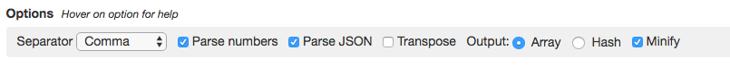

# Jeu d'essai

Le but de l'activité cinsiste à créeer un jeu d'essai permettant de manipuler l'environnement Kafka


SET 'auto.offset.reset' = 'earliest';


### 3. Accedez a votre bash de Kafaka

```
$ docker-compose exec kafka bash 
```

### 4. Création des topics

* Bus Schedule

```
root@kafka:/# kafka-topics --zookeeper zookeeper:32181 --topic bus-sched --create --partitions 3 --replication-factor 1
```

* Bus Events

```
root@kafka:/# kafka-topics --zookeeper zookeeper:32181 --topic bus-events --create --partitions 3 --replication-factor 1
```


### Creation d'un nouveau Stream :

* Ouvrir KSQL CLI :

```
$ docker-compose exec ksql-cli ksql http://ksql-server:8088 
```


* Creer une nouvelle table du topic bus-sched

```
ksql> CREATE TABLE BUS_SCHEDULE (ROUTE_ID INTEGER, \
                           STOP_NUM INTEGER, \
                           ETA BIGINT) \
                     WITH (VALUE_FORMAT='JSON', \
                           KAFKA_TOPIC='bus-sched', \
                          KEY='STOP_NUM');
```

```
ksql> SELECT ROUTE_ID, STOP_NUM, TIMESTAMPTOSTRING(ETA, 'yyyy-MM-dd  HH:mm:ss') FROM BUS_SCHEDULE;
```

* Creer un nouveau Stream du topic bus-events

```
ksql> CREATE STREAM BUS_EVENTS (BUS_ID INTEGER, \
                          ROUTE_ID INTEGER, \
                          TIMESTAMP BIGINT, \
                          LAST_STOP INTEGER) \
                    WITH (VALUE_FORMAT='JSON', \
                          KAFKA_TOPIC='bus-events');
```

```
ksql> SELECT BUS_ID, ROUTE_ID, TIMESTAMPTOSTRING(TIMESTAMP, 'yyyy-MM-dd  HH:mm:ss'), LAST_STOP FROM BUS_EVENTS;
1 | 6 | 2019-03-21  14:00:10 | 925
1 | 6 | 2019-03-22  00:00:10 | 266
1 | 6 | 2019-03-22  01:00:10 | 925
1 | 6 | 2019-03-22  02:00:10 | 925
1 | 6 | 2019-03-21  15:00:10 | 925
1 | 6 | 2019-03-21  16:01:40 | 925
1 | 6 | 2019-03-21  18:00:10 | 925
1 | 6 | 2019-03-21  18:00:10 | 925
1 | 6 | 2019-03-21  19:00:10 | 925
1 | 6 | 2019-03-21  20:00:10 | 268
1 | 6 | 2019-03-21  21:00:10 | 925
1 | 6 | 2019-03-21  23:00:10 | 925
```

```
ksql> CREATE STREAM BUS_EVENTS_WITH_KEY \
          WITH (VALUE_FORMAT='AVRO', \
                KAFKA_TOPIC='bus-events-with-key') AS \
          SELECT BUS_ID, CAST(ROUTE_ID AS STRING) AS ID, TIMESTAMP, LAST_STOP \
                FROM BUS_EVENTS PARTITION BY ID;
```

```
ksql> PRINT 'bus-events-with-key' FROM BEGINNING;
Format:AVRO
3/21/19 10:30:39 PM UTC, 6, {"BUS_ID": 1, "ID": "6", "TIMESTAMP": 1553176810000, "LAST_STOP": 925}
3/21/19 10:30:40 PM UTC, 6, {"BUS_ID": 1, "ID": "6", "TIMESTAMP": 1553212810000, "LAST_STOP": 266}
3/21/19 10:30:44 PM UTC, 6, {"BUS_ID": 1, "ID": "6", "TIMESTAMP": 1553220010000, "LAST_STOP": 925}
3/21/19 10:30:46 PM UTC, 6, {"BUS_ID": 1, "ID": "6", "TIMESTAMP": 1553180410000, "LAST_STOP": 925}
3/21/19 10:30:47 PM UTC, 6, {"BUS_ID": 1, "ID": "6", "TIMESTAMP": 1553184100000, "LAST_STOP": 925}
3/21/19 10:30:53 PM UTC, 6, {"BUS_ID": 1, "ID": "6", "TIMESTAMP": 1553194810000, "LAST_STOP": 925}
3/21/19 10:30:55 PM UTC, 6, {"BUS_ID": 1, "ID": "6", "TIMESTAMP": 1553198410000, "LAST_STOP": 268}
3/21/19 10:30:57 PM UTC, 6, {"BUS_ID": 1, "ID": "6", "TIMESTAMP": 1553202010000, "LAST_STOP": 925}
3/21/19 11:21:41 PM UTC, 6, {"BUS_ID": 1, "ID": "6", "TIMESTAMP": 1553212810000, "LAST_STOP": 266}
```

### Afficher le topic du debut en KSQL

```
ksql> PRINT 'bus-events' FROM BEGINNING;
```

----------

### 5. Accedez a votre bash de Kafaka

```
$ docker-compose exec kafka bash 
```

### 6. Accedez a votre bash de Kafaka

```
$ kafka-console-consumer --bootstrap-server kafka:9092 --topic bus-sched --from-beginning
{ "ROUTE_ID" :  6 , "STOP_NUM" : 266 , "ETA" : 1553216400000 }
{ "ROUTE_ID" :  6 , "STOP_NUM" : 925 , "ETA" : 1553220000000 }
{ "ROUTE_ID" :  6 , "STOP_NUM" : 256 , "ETA" : 1553191200000 }
{ "ROUTE_ID" :  6 , "STOP_NUM" : 231 , "ETA" : 1553194800000 }
{ "ROUTE_ID" :  6 , "STOP_NUM" : 243 , "ETA" : 1553202000000 }
{ "ROUTE_ID" :  6 , "STOP_NUM" : 15128 , "ETA" : 1553176800000 }
{ "ROUTE_ID" :  6 , "STOP_NUM" : 1467 , "ETA" : 1553184000000 }
{ "ROUTE_ID" :  6 , "STOP_NUM" : 247 , "ETA" : 1553187600000 }
{ "ROUTE_ID" :  6 , "STOP_NUM" : 261 , "ETA" : 1553198400000 }
{ "ROUTE_ID" :  6 , "STOP_NUM" : 268 , "ETA" : 1553212800000 }
{ "ROUTE_ID" :  6 , "STOP_NUM" : 15129 , "ETA" : 1553180400000 }
{ "ROUTE_ID" :  6 , "STOP_NUM" : 238 , "ETA" : 1553209200000 }
```

----------


https://docs.confluent.io/current/ksql/docs/developer-guide/syntax-reference.html#tables


## Load files (kafka-console-producer)
Essayer avec la commande kafka-console-producer et `cat:

```
$ cat ~/my_file.json | docker exec \
                   --interactive kafka kafka-console-producer \
                   --broker-list kafka:9092 --topic my_topic
```

## Load files (kafkacat)

https://www.csvjson.com/csv2json



```
$ docker run --interactive \
           --network 300098957_default \
           confluentinc/cp-kafkacat \
            kafkacat -b kafka:29092 \
                    -t my_topic \
                    -K: \
                    -P <<EOF
{"Date":"2019-01-08","Open":7.53,"High":7.6,"Low":7.35,"Close":7.41,"Adj Close":7.41,"Volume":3960900}
{"Date":"2019-01-09","Open":7.44,"High":7.51,"Low":7.38,"Close":7.47,"Adj Close":7.47,"Volume":3316800}
{"Date":"2019-01-10","Open":7.4,"High":7.54,"Low":7.33,"Close":7.52,"Adj Close":7.52,"Volume":2404600}
{"Date":"2019-01-11","Open":7.49,"High":7.65,"Low":7.48,"Close":7.57,"Adj Close":7.57,"Volume":2314300}
{"Date":"2019-01-14","Open":7.52,"High":7.57,"Low":7.44,"Close":7.49,"Adj Close":7.49,"Volume":2442100}
{"Date":"2019-01-15","Open":7.5,"High":7.56,"Low":7.45,"Close":7.53,"Adj Close":7.53,"Volume":1779500}
{"Date":"2019-01-16","Open":7.54,"High":7.71,"Low":7.52,"Close":7.66,"Adj Close":7.66,"Volume":3010200}
{"Date":"2019-01-17","Open":7.65,"High":7.7,"Low":7.57,"Close":7.69,"Adj Close":7.69,"Volume":2543400}
{"Date":"2019-01-18","Open":7.75,"High":7.91,"Low":7.74,"Close":7.86,"Adj Close":7.86,"Volume":3814800}
{"Date":"2019-01-22","Open":7.79,"High":7.88,"Low":7.57,"Close":7.6,"Adj Close":7.6,"Volume":3171400}
{"Date":"2019-01-23","Open":7.63,"High":7.79,"Low":7.62,"Close":7.72,"Adj Close":7.72,"Volume":2077100}
{"Date":"2019-01-24","Open":7.75,"High":7.85,"Low":7.73,"Close":7.77,"Adj Close":7.77,"Volume":1932900}
{"Date":"2019-01-25","Open":7.87,"High":8.1,"Low":7.82,"Close":8.1,"Adj Close":8.1,"Volume":2664400}
{"Date":"2019-01-28","Open":8.05,"High":8.09,"Low":7.96,"Close":8.01,"Adj Close":8.01,"Volume":2327000}
{"Date":"2019-01-29","Open":8.05,"High":8.1,"Low":7.91,"Close":7.96,"Adj Close":7.96,"Volume":2277900}
{"Date":"2019-01-30","Open":8.04,"High":8.13,"Low":7.92,"Close":8.13,"Adj Close":8.13,"Volume":2217700}
{"Date":"2019-01-31","Open":8.11,"High":8.18,"Low":8.02,"Close":8.07,"Adj Close":8.07,"Volume":2446500}
{"Date":"2019-02-01","Open":8.1,"High":8.15,"Low":8.02,"Close":8.11,"Adj Close":8.11,"Volume":2055800}
{"Date":"2019-02-04","Open":8.12,"High":8.25,"Low":8.1,"Close":8.22,"Adj Close":8.22,"Volume":1961400}
{"Date":"2019-02-05","Open":8.25,"High":8.38,"Low":8.25,"Close":8.34,"Adj Close":8.34,"Volume":1934600}
{"Date":"2019-02-06","Open":8.31,"High":8.37,"Low":8.26,"Close":8.31,"Adj Close":8.31,"Volume":2436100}
{"Date":"2019-02-07","Open":8.23,"High":8.25,"Low":8.07,"Close":8.1,"Adj Close":8.1,"Volume":2714400}
{"Date":"2019-02-08","Open":8.05,"High":8.19,"Low":8.03,"Close":8.185,"Adj Close":8.185,"Volume":1044851}
EOF

```
