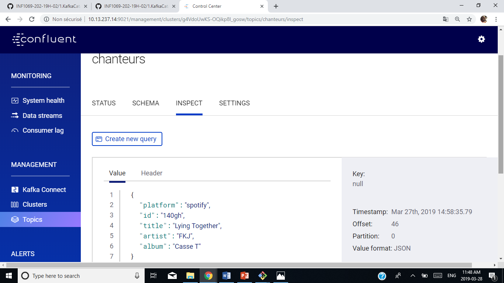
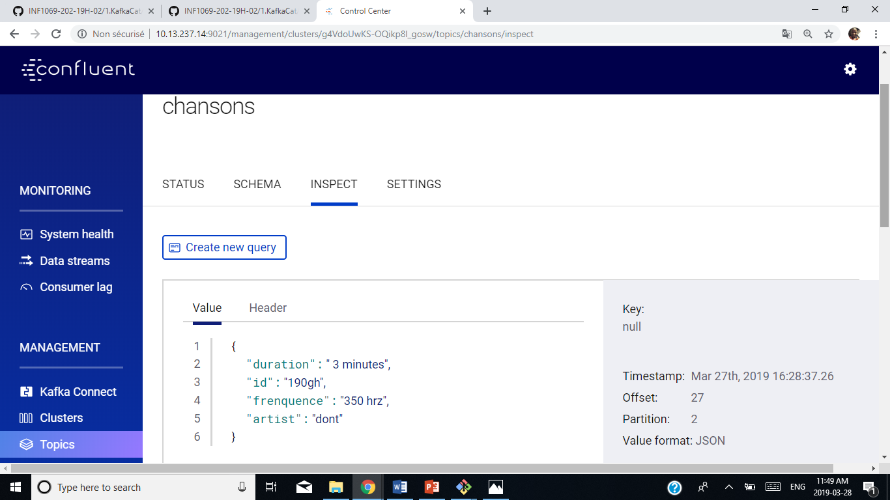

# 🔎KAFKACAT 
## 📍 CRÉER SON ENVIRONNEMENT DANS UN REPERTOIRE:
## 1. Copier le fichier de docker-compose.yml d'apres le repertoire D.Demo.
```
$ cp ../../D.Demo/docker-compose.yml  . 

```
## 2. Enlever les applications de musique
```
$ vi docker-compose.yml
```
## 3. Avant de l'executer dans 1.Kafkacat/ID vous devez supprimer votre environnemnet dans D.Demo
```
$ cd ../../D.Demo
$ docker-compose stop 
$ docker-compose rm 
```
## 📍 Executez votre environnement dans 1.KafkaCat/ID :
```
$ cd ../../1.KafkaCat/ID (ex:300105468) 
$ docker-compose up -d 
```
## 1. Connaitre le nom de switch Docker de KafkaCat

```
$ docker network ls
```
## 2. Faire la liste de tout l'environnment
```
$ docker run --tty --network 300105468_default confluentinc/cp-kafkacat kafkacat -b kafka:29092 -L
```

### 3. Accedez a votre bash de Kafaka

```
$ docker-compose exec kafka bash 
```
### 4. Création des topics
```
root@kafka:/# kafka-topics --zookeeper zookeeper:32181 --topic chanteurs --create --partitions 4 --replication-factor 1
Created topic "chanteurs"
```
```
root@kafka:/# kafka-topics --zookeeper zookeeper:32181 --topic chansons --create --partitions 4 --replication-factor 1
Created topic "chansons"
```
```
$ docker run --interactive \
           --network 300105468_default \
           confluentinc/cp-kafkacat \
            kafkacat -b kafka:29092 \
                    -t my_topic \
                    -K: \
                    -P <<EO
{"Date":"2019-01-08","Open":7.53,"High":7.6,"Low":7.35,"Close":7.41,"Adj Close":7.41,"Volume":3960900}
EOF
```
## 📍 Creation de fichier JSON :

## 1. Vous devez revenir a votre path Develper/INF1069../1.KafkaCat/ID et vous creez un fichier de json
```
$ vi chanson.json 
```
## . Ajouter un code
```
 { "duration":"4 minutes", "id":"140gh", { "frenquence":"500 hrz", "artist":"FKJ"}}
```
en suite vous pouvez ajouter les autres foichiers de chanson$.json avec un des lignes ci-dessous: 
```
{ "duration":"2.5minutes", "id":"180gh", "frenquence":"400 hrz", "artist":"RMB"}
{ "duration":" 3 minutes", "id":"190gh", "frenquence":"350 hrz", "artist":"dont"}
{ "duration":" 3 minutes", "id":"190gh", "frenquence":"350 hrz", "artist":"dont"}
{ "duration":"4 minutes", "id":"140gh", "frenquence":"500 hrz", "artist":"FKJ"}
```
et aussi la même chose pour le fichier de chanteur$.json
```
{ "platform":"spotify", "id":"140gh", "title":"Lying Together", "artist":"FKJ", "album":"Casse T"}
{ "platform":"spotify", "id":"180gh", "title":"dancing Together", "artist":"RMB", "album":"Playing "}
{ "platform":"spotify", "id":"190gh", "title":"Reaggae", "artist":"Lion", "album":"dont"}
{ "platform":"spotify", "id":"200gh", "title":"Nil", "artist":"Formuler", "album":"Labe"}
```
il faut creer des jeux.sh pour chaque topic pour clients_info

``` 
$ nano jeu1.sh
```

Vous allez tapper en suite ce code:


```
#!/bin/bash

function main {
   echo "Copy de fichier"
   for chanteur in chanteur*.json
   do
     docker exec --interactive kafka kafka-console-producer --broker-list kafka:9092 --topic chanteurs <  ./$chanteur
   done
}

main
```

## * Faire la même chose pour le topic chanson:
```
#!/bin/bash

function main {
   echo "Copy de fichier"
   for chanson in chanson*.json
   do
     docker exec --interactive kafka kafka-console-producer --broker-list kafka:9092 --topic chansons <  ./$chanson
   done
}

main
```
Pour tester votre fichier de json vous devez juste faire:
```
$ sh jeu*.sh
Copy de fichier
>>>>>>>>>>>>>>>>>>>>>>>>>>>>>>>>>>>>>>>>
```
## * Pour voir le resultat vous pouvez voir dans le site http://10.13.237.14:9021/management/clusters

# ♦ CHANTEURS
 

# ♦ CHANSONS


## 📍 Création d'un nouveau Stream:
Premièrement il faut aller premierment au KSQL Bash :
```
$ docker-compose exec ksql-cli ksql http://ksql-server:8088
```
## Creaton d'un nouveau Stream du topic chanteurs
```
ksql> CREATE STREAM ksql_chanteurs (platform string, id string, title string, artist string, album string) WITH (KAFKA_TOPIC='chanteurs', VALUE_FORMAT='JSON');
 Message
----------------
 Stream created
----------------
```
## Pour voir tous les info des chanteurs :

```
ksql> SELECT * FROM ksql_chanteurs ;

1553712889634 | null | spotify | 180gh | dancing Together | RMB | Playing
1553712891592 | null | spotify | 140gh | Lying Together | FKJ | Casse T
1553712897346 | null | spotify | 200gh | Nil | Formuler | Labe
1553713115820 | null | spotify | 190gh | Reaggae | Lion | dont
1553713115820 | null | spotify | 180gh | dancing Together | RMB | Playing
1553713115794 | null | spotify | 140gh | Lying Together | FKJ | Casse T
1553713115821 | null | spotify | 200gh | Nil | Formuler | Labe
1553713118064 | null | spotify | 140gh | Lying Together | FKJ | Casse T
1553713119970 | null | spotify | 180gh | dancing Together | RMB | Playing
1553713121871 | null | spotify | 190gh | Reaggae | Lion | dont
1553713123881 | null | spotify | 200gh | Nil | Formuler | Labe
```
## pour voir les streams 
```
ksql> show streams ;

 Stream Name    | Kafka Topic | Format
---------------------------------------
 KSQL_CHANTEURS | chanteurs   | JSON
---------------------------------------
ksql>
```
## Pour Décrire le stream
```
ksql> DESCRIBE ksql_chanteurs ;

Name                 : KSQL_CHANTEURS
 Field    | Type
--------------------------------------
 ROWTIME  | BIGINT           (system)
 ROWKEY   | VARCHAR(STRING)  (system)
 PLATFORM | VARCHAR(STRING)
 ID       | BIGINT
 TITLE    | VARCHAR(STRING)
 ARTIST   | VARCHAR(STRING)
 ALBUM    | VARCHAR(STRING)
--------------------------------------
```
## Créer une table d'apres le topic chansons :

Tout d'abord il s'agit de créer un stream qui s'appelle ```ksql_chansons``` afin de terminer toutes les colonnes.
```
ksql> CREATE STREAM ksql_chansons (DURATION STRING , ID STRING , FREQUENCE STRING , ARTIST STRING ) WITH  (KAFKA_TOPIC='chansons',VALUE_FORMAT='JSON');

 Message
----------------
 Stream created
----------------

```
Pour voir tous les informations de cette table :

```
ksql> SELECT * FROM ksql_chansons;

1553716775324 | null | 1.90 minutes | 200gh | null | labe
1553716954418 | null |  3 minutes | 190gh | 350 hrz | dont
1553716996573 | null | 4 minutes | 140gh | 500 hrz | FKJ
1553716996573 | null |  3 minutes | 190gh | 350 hrz | dont
1553716998460 | null | 4 minutes | 140gh | null | FKJ
1553717801533 | null |  3 minutes | 190gh | 350 hrz | dont
1553717803516 | null | 4 minutes | 140gh | null | FKJ
1553717805359 | null | 2.5minutes | 180gh | null | RMB
1553717807229 | null |  3 minutes | 190gh | null | dont
1553717809115 | null | 1.90 minutes | 200gh | null | labe
```
Création de Stream ```chansons_with_key``` avec un nouveau topic ```chansons-with-key```partition par ID:
```
ksql> CREATE STREAM ksql_chansons_with_key \
       WITH (VALUE_FORMAT='AVRO', KAFKA_TOPIC='chansons-with-key') \
       AS SELECT DURATION , CAST(ID AS STRING) AS ID, FREQUENCE, ARTIST \
       FROM ksql_chansons PARTITION BY ID ;
       
Message
----------------------------
 Stream created and running
----------------------------

```

Et finalement on crée la table d'après le topic ```chansons-with-key```:

```
ksql> CREATE TABLE ksql_chansons_table \
       WITH (VALUE_FORMAT='AVRO',  \
       KAFKA_TOPIC='chansons-with-key', KEY='ID') ;
       
       
 Message
---------------
 Table created
---------------

```
Pour voir toutes les informations de cette table: 
```
ksql> SELECT * FROM ksql_chansons_table ;

1553716996573 | 140gh | 4 minutes | 140gh | 500 hrz | FKJ
1553716996573 | 190gh |  3 minutes | 190gh | 350 hrz | dont
1553716998460 | 140gh | 4 minutes | 140gh | null | FKJ
1553717803516 | 140gh | 4 minutes | 140gh | null | FKJ
1553717801533 | 190gh |  3 minutes | 190gh | 350 hrz | dont
1553718510452 | 190gh |  3 minutes | 190gh | 350 hrz | dont
1553718510452 | 190gh |  3 minutes | 190gh | 350 hrz | dont
1553718510452 | 140gh | 4 minutes | 140gh | 500 hrz | FKJ
1553718510451 | 180gh | 2.5minutes | 180gh | 400 hrz | RMB
1553718512335 | 140gh | 4 minutes | 140gh | null | FKJ
1553718514542 | 180gh | 2.5minutes | 180gh | null | RMB
1553718517260 | 190gh |  3 minutes | 190gh | null | dont
1553718519997 | 200gh | 1.90 minutes | 200gh | null | lab

```
### Pour faire la joincture entre le Stream ```ksql_chanteurs``` et la table ```ksql_chansons_table``` :

```
SELECT * FROM ksql_chanteurs CI  \
         LEFT OUTER JOIN \
         ksql_chansons_table PR \
         ON  PR.ID = CI.ID ;
         
Can't join KSQL_CHANTEURS with KSQL_CHANSONS_TABLE since the number of partitions don't match. KSQL_CHANTEURS partitions =
 3; KSQL_CHANSONS_TABLE partitions = 4. Please repartition either one so that the number of partitions match.

```
On recréer une partition =4 pour ksql_chanteurs
```
ksql> CREATE STREAM KSQL_CHANTEURS WITH (PARTITIONS =4) \ 
      as SELECT * FROM KSQL_CHANTEURS;
```
## On relance la commande (avec patirence🤣🤣🤣)

```
SELECT * FROM ksql_chanteurs CI  \
         LEFT OUTER JOIN \
         ksql_chansons_table PR \
         ON  PR.ID = CI.ID ;

1554146529722 | 190gh | spotify | 190gh | Reaggae | Lion | dont | 1554147298287 | 190gh |  3 minutes | 190gh | null | dont
1554146560946 | 180gh | spotify | 180gh | dancing Together | RMB | Playing  | 1554147296508 | 180gh | 2.5minutes | 180gh | null | RMB
1554146595240 | 140gh | spotify | 140gh | Lying Together | FKJ | Casse T | 1554147294652 | 140gh | 4 minutes | 140gh | null | FKJ
1554146595252 | 190gh | spotify | 190gh | Reaggae | Lion | dont | 1554147298287 | 190gh |  3 minutes | 190gh | null | dont
1554146597055 | 140gh | spotify | 140gh | Lying Together | FKJ | Casse T | 1554147294652 | 140gh | 4 minutes | 140gh | null | FKJ
1554146598861 | 180gh | spotify | 180gh | dancing Together | RMB | Playing  | 1554147296508 | 180gh | 2.5minutes | 180gh | null | RMB
1554146723764 | 140gh | spotify | 140gh | Lying Together | FKJ | Casse T | 1554147294652 | 140gh | 4 minutes | 140gh | null | FKJ
1554146723776 | 190gh | spotify | 190gh | Reaggae | Lion | dont | 1554147298287 | 190gh |  3 minutes | 190gh | null | dont
1554146729280 | 190gh | spotify | 190gh | Reaggae | Lion | dont | 1554147298287 | 190gh |  3 minutes | 190gh | null | dont
1554147000041 | 140gh | spotify | 140gh | Lying Together | FKJ | Casse T | 1554147294652 | 140gh | 4 minutes | 140gh | null | FKJ
1554146568119 | 200gh | spotify | 200gh | Nil | Formuler | Labe | 1554147300106 | 200gh | 1.90 minutes | 200gh | null | labe
1554146731073 | 200gh | spotify | 200gh | Nil | Formuler | Labe | 1554147300106 | 200gh | 1.90 minutes | 200gh | null | labe
1554146529722 | 180gh | spotify | 180gh | dancing Together | RMB | Playing  | 1554147296508 | 180gh | 2.5minutes | 180gh | null | RMB
1554146560919 | 140gh | spotify | 140gh | Lying Together | FKJ | Casse T | 1554147294652 | 140gh | 4 minutes | 140gh | null | FKJ
1554146560946 | 190gh | spotify | 190gh | Reaggae | Lion | dont | 1554147298287 | 190gh |  3 minutes | 190gh | null | dont
1554146564509 | 180gh | spotify | 180gh | dancing Together | RMB | Playing  | 1554147296508 | 180gh | 2.5minutes | 180gh | null | RMB
1554146595251 | 180gh | spotify | 180gh | dancing Together | RMB | Playing  | 1554147296508 | 180gh | 2.5minutes | 180gh | null | RMB
1554146600708 | 190gh | spotify | 190gh | Reaggae | Lion | dont | 1554147298287 | 190gh |  3 minutes | 190gh | null | dont
1554146723776 | 180gh | spotify | 180gh | dancing Together | RMB | Playing  | 1554147296508 | 180gh | 2.5minutes | 180gh | null | RMB
1554147001842 | 180gh | spotify | 180gh | dancing Together | RMB | Playing  | 1554147296508 | 180gh | 2.5minutes | 180gh | null | RMB
1554146531637 | 140gh | spotify | 140gh | Lying Together | FKJ | Casse T | 1554147294652 | 140gh | 4 minutes | 140gh | null | FKJ
1554146535532 | 190gh | spotify | 190gh | Reaggae | Lion | dont | 1554147298287 | 190gh |  3 minutes | 190gh | null | dont
1554146566313 | 190gh | spotify | 190gh | Reaggae | Lion | dont | 1554147298287 | 190gh |  3 minutes | 190gh | null | dont
1554146600171 | 180gh | spotify | 180gh | dancing Together | RMB | Playing  | 1554147296508 | 180gh | 2.5minutes | 180gh | null | RMB
1554146725553 | 140gh | spotify | 140gh | Lying Together | FKJ | Casse T | 1554147294652 | 140gh | 4 minutes | 140gh | null | FKJ
1554146727340 | 180gh | spotify | 180gh | dancing Together | RMB | Playing  | 1554147296508 | 180gh | 2.5minutes | 180gh | null | RMB
1554146998160 | 140gh | spotify | 140gh | Lying Together | FKJ | Casse T | 1554147294652 | 140gh | 4 minutes | 140gh | null | FKJ
1554146998186 | 190gh | spotify | 190gh | Reaggae | Lion | dont | 1554147298287 | 190gh |  3 minutes | 190gh | null | dont
1554147003659 | 190gh | spotify | 190gh | Reaggae | Lion | dont | 1554147298287 | 190gh |  3 minutes | 190gh | null | dont
1554147502455 | 140gh | spotify | 140gh | Lying Together | FKJ | Casse T | 1554147489198 | 140gh | 4 minutes | 140gh | null | FKJ
1554147502483 | 190gh | spotify | 190gh | Reaggae | Lion | dont | 1554147493107 | 190gh |  3 minutes | 190gh | null | dont
1554147502482 | 180gh | spotify | 180gh | dancing Together | RMB | Playing  | 1554147491304 | 180gh | 2.5minutes | 180gh | null | RMB
1554147504357 | 140gh | spotify | 140gh | Lying Together | FKJ | Casse T | 1554147489198 | 140gh | 4 minutes | 140gh | null | FKJ
1554147507367 | 180gh | spotify | 180gh | dancing Together | RMB | Playing  | 1554147491304 | 180gh | 2.5minutes | 180gh | null | RMB
1554147509161 | 190gh | spotify | 190gh | Reaggae | Lion | dont | 1554147493107 | 190gh |  3 minutes | 190gh | null | dont
1554147511113 | 200gh | spotify | 200gh | Nil | Formuler | Labe | 1554147494905 | 200gh | 1.90 minutes | 200gh | null | labe
1554147516959 | 140gh | spotify | 140gh | Lying Together | FKJ | Casse T | 1554147489198 | 140gh | 4 minutes | 140gh | null | FKJ
1554147516971 | 190gh | spotify | 190gh | Reaggae | Lion | dont | 1554147493107 | 190gh |  3 minutes | 190gh | null | dont
1554147516970 | 180gh | spotify | 180gh | dancing Together | RMB | Playing  | 1554147491304 | 180gh | 2.5minutes | 180gh | null | RMB

```
