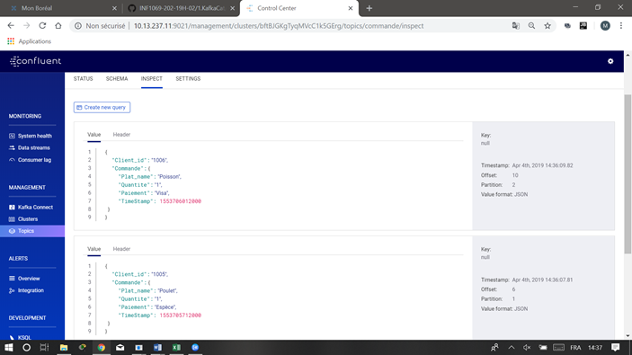

KAFKACAT

⭕️ Environnement Kafka - KSQL

Mon environnement

0.	Creation de mon repertoire
````
bouchichi@Doha MINGW64 ~/Developer/INF1069-202-19H-02/1.KafkaCat
$ mkdir 300107710 
$ cd 300107710
bouchichi@Doha MINGW64 ~/Developer/INF1069-202-19H-02/1.KafkaCat/300107710
````
1.	Récupérer le fichier docker-compose.yml de D.DEMO
````
bouchichi@Doha MINGW64 ~/Developer/INF1069-202-19H-02/1.KafkaCat/300107710

$ cp ../../D.Demo/docker-compose.yml .
````
1.1.	Modification du fichier:
````
bouchichi@Doha MINGW64 ~/Developer/INF1069-202-19H-02/1.KafkaCat/300107710

$ nano docker-compose.yml
````
1.2.	Execution

````
$ docker-compose up -d 
$ docker network ls
$ docker run --tty --network 300107710_default confluentinc/cp-kafkacat kafkacat -b kafka:29092 -L
````
2. Création de de deux topics:
-	client
-	commande

2.1  Création du topic client
````
$ winpty docker-compose exec kafka bash
root@kafka:/#

    # kafka-topics --zookeeper zookeeper:32181 --topic client --create --partitions 3 --replication-factor 1

Created topic "client".

2.2 Création du topic commande

root@kafka:/# kafka-topics --zookeeper zookeeper:32181 --topic commande --create --partitions 3 --replication-factor 1

Created topic "commande".
````

🅰️ Données

1️⃣ Création du jeu d'essaie

1.1 Les données 
````
$ nano client1.json    $ nano client2.json ...  $ nano client6.json     
````
````
{"client_id":"1001", "client_name":"Jack", "Client_address":{"City":"Toronto", "Street_name":"Church St", "Street_num": 12, "Unit":805}}
{"client_id":"1002", "client_name":"Paul", "Client_address":{"City":"Toronto", "Street_name":"Yonge St", "Street_num":150, "Unit":615}}
{"client_id":"1003", "client_name":"Alfred", "Client_address":{"City":"Toronto", "Street_name":"Danforth Ave", "Street_num":150, "Unit":608}}
{"client_id":"1004", "client_name":"Sandra", "Client_address":{"City":"Toronto", "Street_name":"Spadina Ave", "Street_num":30, "Unit":903}}
{"client_id":"1005", "client_name":"Merinda", "Client_address":{"City":"Toronto", "Street_name":"Yonge St", "Street_num":450, "Unit":702}}
{"client_id":"1006", "client_name":"Jane", "Client_address":{"City":"Toronto", "Street_name":"Bay St", "Street_num":1250, "Unit":615}}

````
 
````
$ nano commande1.json    $ nano commande2.json  ...   $ nano commande6.json
````
````
{"client_id":"1001", "Commande":{"Plat_name":"Tagine", "Quantite":1, "Paiement":"Espèce", "TimeStamp":1553176810000}}
{"client_id":"1002", "Commande":{"Plat_name":"Couscous", "Quantité":1, "Paiement":"Visa", "TimeStamp":1553712492000}}
{"client_id":"1003", "Commande":{"Plat_name":"Pastilla", "Quantité":1, "Paiement":"Master", "TimeStamp":1553712912000}}
{"client_id":"1004", "Commande":{"Plat_name":"Zaalook", "Quantité":1, "Paiement":"Visa", "TimeStamp":1553716512000}}
{"client_id":"1005", "Commande":{"Plat_name":"Poulet", "Quantité":1, "Paiement":"Espèce", "TimeStamp":1553705712000}}
{"client_id":"1006", "Commande":{"Plat_name":"Poisson", "Quantité":1, "Paiement":"Visa", "TimeStamp":1553706012000}}

````
1.2 Création du shell script

1.2.0  Création du shell script client

````
$ nanao client.sh
````
````
#!/bin/bash

function main {
   echo "Copy de fichier"
   for client in client*.json
   do
     docker exec --interactive kafka kafka-console-producer --broker-list kafka:9092 --topic client <  ./$client
   done
}

main

````

1.2.1 Création du shell script commande
 
 ````
$ nanao commande.sh
````

````
#!/bin/bash

function main {
   echo "Copy de fichier"
   for commande in commande*.json
   do
     docker exec --interactive kafka kafka-console-producer --broker-list kafka:9092 --topic commande <  ./$commande
   done
}


main
````
🅱️ Flux (KSQL)

6. Ouverture de ksql bach

````
bouchichi@Doha MINGW64 ~/Developer/INF1069-202-19H-02/1.KafkaCat/300107710 (master)
$ winpty docker-compose exec ksql-cli ksql http://ksql-server:8088

                  ===========================================
                  =        _  __ _____  ____  _             =
                  =       | |/ // ____|/ __ \| |            =
                  =       | ' /| (___ | |  | | |            =
                  =       |  <  \___ \| |  | | |            =
                  =       | . \ ____) | |__| | |____        =
                  =       |_|\_\_____/ \___\_\______|       =
                  =                                         =
                  =  Streaming SQL Engine for Apache Kafka® =
                  ===========================================

Copyright 2017-2018 Confluent Inc.

CLI v5.1.0, Server v5.1.0 located at http://ksql-server:8088

Having trouble? Type 'help' (case-insensitive) for a rundown of how things work!

ksql>
````
6.1  Création de stream commande en KSQL

````
ksql> CREATE STREAM commande \
      (client_id INTEGER, \
       Commande STRUCT< \
       Plat_name STRING,\
       Quantite INTEGER,\
      Paiement STRING
      TimeStamp BIGINT>)\
    WITH (KAFKA_TOPIC='commande', VALUE_FORMAT='JSON');
````
````
 Message
----------------
 Stream created
----------------
````
o. Description du stream commande 
````
ksql> DESCRIBE commande;


````
````
ksql> SELECT * FROM COMMANDE;


````

6.2  Création de Stream client en KSQL
````
ksql> CREATE STREAM client \
      (client_id INTEGER, \
       client_name STRING, \
       Client_address STRUCT< \
       City STRING,\
       Street_name STRING,\
       Street_num INTEGER,\
      Unit INTEGER >)\
    WITH (KAFKA_TOPIC='client', VALUE_FORMAT='JSON');
````

````
 Message
----------------
 Stream created
----------------
````
o. Description de Stream client
````
ksql> DESCRIBE client;

Name                 : CLIENT
 Field          | Type

------------------------------------------------------------------------------------
--------------------------
 ROWTIME        | BIGINT           (system)

 ROWKEY         | VARCHAR(STRING)  (system)

 CLIENT_ID      | INTEGER

 CLIENT_NAME    | VARCHAR(STRING)

 CLIENT_ADDRESS | STRUCT<CITY VARCHAR(STRING), STREET_NAME VARCHAR(STRING), STREET_N
UM INTEGER, UNIT INTEGER>
------------------------------------------------------------------------------------
--------------------------
For runtime statistics and query details run: DESCRIBE EXTENDED <Stream,Table>;
ksql>

````
````
bouchichi@Doha MINGW64docker ~/Developer/INF1069-202-19H-02/1.KafkaCat/300107710 (master)
$ sh Commande.sh
Hello world
>>>>>>>>>>>>>>>>
````



````
bouchichi@Doha MINGW64 ~/Developer/INF1069-202-19H-02/1.KafkaCat/300107710 (master)
$ sh client.sh
Copy de fichier
>>>>>>>>>>>>>>>>
````


O. Création de Stream commande_with_key
````
ksql> CREATE STREAM commande_with_key\
>      (client_id INTEGER, \
>       Commande STRUCT< \
>       Plat_name STRING,\
>       Quantite INTEGER,\
>      Paiement STRING, TIMESTAMP BIGINT > )\
>    WITH (KAFKA_TOPIC='commande', VALUE_FORMAT='JSON');

 Message
----------------
 Stream created
----------------
ksql> DESCRIBE COMMANDE_KEY;

Name                 : COMMANDE_KEY
 Field     | Type

------------------------------------------------------------------------------------
-------------------------
 ROWTIME   | BIGINT           (system)

 ROWKEY    | VARCHAR(STRING)  (system)

 CLIENT_ID | INTEGER

 COMMANDE  | STRUCT<PLAT_NAME VARCHAR(STRING), QUANTITE INTEGER, PAIEMENT VARCHAR(ST
RING), TIMESTAMP BIGINT>
------------------------------------------------------------------------------------
-------------------------
For runtime statistics and query details run: DESCRIBE EXTENDED <Stream,Table>;
ksql>

````
O. Creation de Stream commande_with_key
````
ksql> CREATE STREAM commande_with_key \
>          WITH (VALUE_FORMAT='AVRO', \
>                KAFKA_TOPIC='commande-with-key') AS \
>                 SELECT client_id, Commande->Plat_name, Commande->Quantite, Commande->Paiement, Commande->TimeStamp\
>                 FROM commande PARTITION BY client_id;

----------------------------
 Stream created and running
----------------------------
ksql> DESCRIBE COMMANDE_WITH_KEY;

Name                 : COMMANDE_WITH_KEY
 Field     | Type
---------------------------------------
 ROWTIME   | BIGINT           (system)
 ROWKEY    | VARCHAR(STRING)  (system)
 CLIENT_ID | INTEGER
 ID        | VARCHAR(STRING)
---------------------------------------
For runtime statistics and query details run: DESCRIBE EXTENDED <Stream,Table>;
ksql>
````
💯 - Présentation [Point en plus]

  0 - Comporte un fichier README.md
  
  1 - Comporte des commandes bash
  
  2 - Comporte des commandes KSQL
  
  3 - Comporte des resultats de requestes KSQL
  
🆎 - Composition (KSQL JOIN)

1 - À partir du STREAM ou de la TABLE, créer une jointure

2 - Afficher le résultat de la jointure

