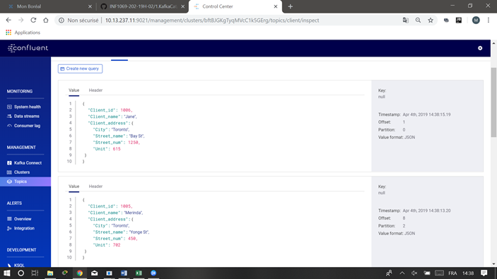

KAFKACAT

⭕️ Environnement Kafka - KSQL

Mon environnement

0.	Creation de mon repertoire
````
bouchichi@Doha MINGW64 ~/Developer/INF1069-202-19H-02/1.KafkaCat
$ mkdir 300107710 
$ cd 300107710
bouchichi@Doha MINGW64 ~/Developer/INF1069-202-19H-02/1.KafkaCat/300107710
````
1.	Récupérer le fichier docker-compose.yml de D.DEMO
````
bouchichi@Doha MINGW64 ~/Developer/INF1069-202-19H-02/1.KafkaCat/300107710

$ cp ../../D.Demo/docker-compose.yml .
````
1.1.	Modification du fichier:
````
bouchichi@Doha MINGW64 ~/Developer/INF1069-202-19H-02/1.KafkaCat/300107710

$ nano docker-compose.yml
````
1.2.	Execution

````
$ docker-compose up -d 
$ docker network ls
$ docker run --tty --network 300107710_default confluentinc/cp-kafkacat kafkacat -b kafka:29092 -L
````
2. Création de de deux topics:
-	client
-	commande

2.1  Création du topic client
````
$ winpty docker-compose exec kafka bash
root@kafka:/#

    root@kafka:/# kafka-topics --zookeeper zookeeper:32181 --topic client --create --partitions 4 --replication-factor 1

Created topic "client".


2.2 Création du topic commande

root@kafka:/# kafka-topics --zookeeper zookeeper:32181 --topic commande --create --partitions 4 --replication-factor 1

Created topic "commande".


````

🅰️ Données

1️⃣ Création du jeu d'essaie

1.1 Les données 
````
$ nano client1.json    $ nano client2.json ...  $ nano client6.json     
````
````
{"client_id":"1001", "client_name":"Jack", "Client_address":{"City":"Toronto", "Street_name":"Church St", "Street_num": 12, "Unit":805}}
{"client_id":"1002", "client_name":"Paul", "Client_address":{"City":"Toronto", "Street_name":"Yonge St", "Street_num":150, "Unit":615}}
{"client_id":"1003", "client_name":"Alfred", "Client_address":{"City":"Toronto", "Street_name":"Danforth Ave", "Street_num":150, "Unit":608}}
{"client_id":"1004", "client_name":"Sandra", "Client_address":{"City":"Toronto", "Street_name":"Spadina Ave", "Street_num":30, "Unit":903}}
{"client_id":"1005", "client_name":"Merinda", "Client_address":{"City":"Toronto", "Street_name":"Yonge St", "Street_num":450, "Unit":702}}
{"client_id":"1006", "client_name":"Jane", "Client_address":{"City":"Toronto", "Street_name":"Bay St", "Street_num":1250, "Unit":615}}

````
 
````
$ nano commande1.json    $ nano commande2.json  ...   $ nano commande6.json
````
````
{"client_id":"1001", "Commande":{"Plat_name":"Tagine", "Quantite":1, "Paiement":"Espèce", "TimeStamp":1553176810000}}
{"client_id":"1002", "Commande":{"Plat_name":"Couscous", "Quantité":1, "Paiement":"Visa", "TimeStamp":1553712492000}}
{"client_id":"1003", "Commande":{"Plat_name":"Pastilla", "Quantité":1, "Paiement":"Master", "TimeStamp":1553712912000}}
{"client_id":"1004", "Commande":{"Plat_name":"Zaalook", "Quantité":1, "Paiement":"Visa", "TimeStamp":1553716512000}}
{"client_id":"1005", "Commande":{"Plat_name":"Poulet", "Quantité":1, "Paiement":"Espèce", "TimeStamp":1553705712000}}
{"client_id":"1006", "Commande":{"Plat_name":"Poisson", "Quantité":1, "Paiement":"Visa", "TimeStamp":1553706012000}}

````
1.2 Création du shell script

1.2.0  Création du shell script client

````
$ nanao client.sh
````
````
#!/bin/bash

function main {
   echo "Copy de fichier"
   for client in client*.json
   do
     docker exec --interactive kafka kafka-console-producer --broker-list kafka:9092 --topic client <  ./$client
   done
}

main

````

1.2.1 Création du shell script commande
 
 ````
$ nanao commande.sh
````

````
#!/bin/bash

function main {
   echo "Copy de fichier"
   for commande in commande*.json
   do
     docker exec --interactive kafka kafka-console-producer --broker-list kafka:9092 --topic commande <  ./$commande
   done
}


main
````
🅱️ Flux (KSQL)

6. Ouverture de ksql bach

````
bouchichi@Doha MINGW64 ~/Developer/INF1069-202-19H-02/1.KafkaCat/300107710 (master)
$ winpty docker-compose exec ksql-cli ksql http://ksql-server:8088

                  ===========================================
                  =        _  __ _____  ____  _             =
                  =       | |/ // ____|/ __ \| |            =
                  =       | ' /| (___ | |  | | |            =
                  =       |  <  \___ \| |  | | |            =
                  =       | . \ ____) | |__| | |____        =
                  =       |_|\_\_____/ \___\_\______|       =
                  =                                         =
                  =  Streaming SQL Engine for Apache Kafka® =
                  ===========================================

Copyright 2017-2018 Confluent Inc.

CLI v5.1.0, Server v5.1.0 located at http://ksql-server:8088

Having trouble? Type 'help' (case-insensitive) for a rundown of how things work!

ksql>
````
6.1  Création de stream commande en KSQL

````
ksql> CREATE STREAM commande \
      (client_id INTEGER, \
       Commande STRUCT< \
       Plat_name STRING,\
       Quantite INTEGER,\
      Paiement STRING,\
      TimeStamp BIGINT>)\
    WITH (KAFKA_TOPIC='commande', VALUE_FORMAT='JSON');
````
````
 Message
----------------
 Stream created
----------------
````
o. Description du stream commande 
````
ksql> DESCRIBE commande;

Name                 : COMMANDE
 Field     | Type
-------------------------------------------------------------------------------------------------------------
 ROWTIME   | BIGINT           (system)
 ROWKEY    | VARCHAR(STRING)  (system)
 CLIENT_ID | INTEGER
 COMMANDE  | STRUCT<PLAT_NAME VARCHAR(STRING), QUANTITE INTEGER, PAIEMENT VARCHAR(STRING), TIMESTAMP BIGINT>
-------------------------------------------------------------------------------------------------------------
For runtime statistics and query details run: DESCRIBE EXTENDED <Stream,Table>;
ksql>
````

1. On demarre un 1er terminal pour lancer le jeu $ sh Commande.sh. Sur un 2ème terminal, on lance une requette ksql ksql> SELECT * FROM Commande; pour le test du jeu.
````
bouchichi@Doha MINGW64 ~/Developer/INF1069-202-19H-02/1.KafkaCat/300107710 (master)
$ sh commande.sh
Copy de fichier
>>>>>>>>>>>>>>>
````
````
ksql> SELECT * FROM commande;
1554299018400 | null | 1001 | {PLAT_NAME=Tagine, QUANTITE=1, PAIEMENT=Espèce, TIMESTAMP=1553176810000}
1554299020341 | null | 1002 | {PLAT_NAME=Couscous, QUANTITE=1, PAIEMENT=Visa, TIMESTAMP=1553712492000}
1554299022364 | null | 1003 | {PLAT_NAME=Pastilla, QUANTITE=1, PAIEMENT=Master, TIMESTAMP=1553712912000}
1554299024324 | null | 1004 | {PLAT_NAME=Zaalook, QUANTITE=1, PAIEMENT=Visa, TIMESTAMP=1553716512000}
1554299026209 | null | 1005 | {PLAT_NAME=Poulet, QUANTITE=1, PAIEMENT=Espèce, TIMESTAMP=1553705712000}
1554299028151 | null | 1006 | {PLAT_NAME=Poisson, QUANTITE=1, PAIEMENT=Visa, TIMESTAMP=1553706012000}
````

6.2  Création de Stream client en KSQL
````
ksql> CREATE STREAM client \
      (Client_id INTEGER, \
       Client_name STRING, \
       Client_address STRUCT< \
       City STRING,\
       Street_name STRING,\
       Street_num INTEGER,\
      Unit INTEGER >)\
    WITH (KAFKA_TOPIC='client', VALUE_FORMAT='JSON');
````

````
 Message
----------------
 Stream created
----------------
````
o. Description de Stream client
````
ksql> DESCRIBE client;

Name                 : CLIENT
 Field          | Type
--------------------------------------------------------------------------------------------------------------
 ROWTIME        | BIGINT           (system)
 ROWKEY         | VARCHAR(STRING)  (system)
 CLIENT_ID      | INTEGER
 CLIENT_NAME    | VARCHAR(STRING)
 CLIENT_ADDRESS | STRUCT<CITY VARCHAR(STRING), STREET_NAME VARCHAR(STRING), STREET_NUM INTEGER, UNIT INTEGER>
--------------------------------------------------------------------------------------------------------------
For runtime statistics and query details run: DESCRIBE EXTENDED <Stream,Table>;
ksql>
````
1. On demarre un 1er terminal pour lancer le jeu $ sh client.sh. Sur un 2ème terminal, on lance une requette ksql ksql> SELECT * FROM client; pour le test du jeu.
````
ksql> SELECT * FROM client;
1554300196349 | null | 1001 | Jack | {CITY=Toronto, STREET_NAME=Church St, STREET_NUM=12, UNIT=805}
1554300198270 | null | 1002 | Paul | {CITY=Toronto, STREET_NAME=Yonge St, STREET_NUM=150, UNIT=615}
1554300200172 | null | 1003 | Alfred | {CITY=Toronto, STREET_NAME=Danforth Ave, STREET_NUM=150, UNIT=608}
1554300202152 | null | 1004 | Sandra | {CITY=Toronto, STREET_NAME=Spadina Ave, STREET_NUM=305, UNIT=903}
1554300204062 | null | 1005 | Merinda | {CITY=Toronto, STREET_NAME=Yonge St, STREET_NUM=450, UNIT=702}
1554300206002 | null | 1006 | Jane | {CITY=Toronto, STREET_NAME=null, STREET_NUM=1250, UNIT=615}
````
````
bouchichi@Doha MINGW64 ~/Developer/INF1069-202-19H-02/1.KafkaCat/300107710 (master)
$ sh commande.sh
Copy de fichier
>>>>>>>>>>>>
````


````
bouchichi@Doha MINGW64 ~/Developer/INF1069-202-19H-02/1.KafkaCat/300107710 (master)
$ sh client.sh
Copy de fichier
>>>>>>>>>>>>>>>>
````


6.3 Création de Stream client_with_key pour enlever la valeur Null
````
ksql> CREATE STREAM client_with_key \
     WITH (VALUE_FORMAT='AVRO', \
     KAFKA_TOPIC='client_with_key') AS \
           SELECT Client_id, Client_name, Client_address ->City, Client_address ->Street_name, Client_address ->Street_num, Client_address->Unit \
                 FROM client PARTITION BY Client_id;

 Message
----------------------------
 Stream created and running
----------------------------
````

Description du stream client_with_key;
````
ksql> DESCRIBE client_with_key;

Name                 : CLIENT_WITH_KEY
 Field                       | Type
---------------------------------------------------------
 ROWTIME                     | BIGINT           (system)
 ROWKEY                      | VARCHAR(STRING)  (system)
 CLIENT_ID                   | INTEGER
 CLIENT_NAME                 | VARCHAR(STRING)
 CLIENT_ADDRESS__CITY        | VARCHAR(STRING)
 CLIENT_ADDRESS__STREET_NAME | VARCHAR(STRING)
 CLIENT_ADDRESS__STREET_NUM  | INTEGER
 CLIENT_ADDRESS__UNIT        | INTEGER
---------------------------------------------------------
For runtime statistics and query details run: DESCRIBE EXTENDED <Stream,Table>;
ksql>
````
````
bouchichi@Doha MINGW64 ~/Developer/INF1069-202-19H-02/1.KafkaCat/300107710 (master)
$ sh client.sh
Copy de fichier
>>>>>>>>>>>>


ksql> SELECT * FROM client_with_key;
1554301921601 | 1001 | 1001 | Jack | Toronto | Church St | 12 | 805
1554301923555 | 1002 | 1002 | Paul | Toronto | Yonge St | 150 | 615
1554301925480 | 1003 | 1003 | Alfred | Toronto | Danforth Ave | 150 | 608
1554301927447 | 1004 | 1004 | Sandra | Toronto | Spadina Ave | 305 | 903
1554301929378 | 1005 | 1005 | Merinda | Toronto | Yonge St | 450 | 702
1554301931307 | 1006 | 1006 | Jane | Toronto | null | 1250 | 615

````

6.4 Creation de la Table client_table 
````
ksql> CREATE TABLE client_table WITH (VALUE_FORMAT='AVRO', KAFKA_TOPIC='client_with_key', KEY='Client_id');

 Message
---------------
 Table created
---------------
````
6.4 Description de la Table client_table 

````
ksql> DESCRIBE client_table;

Name                 : CLIENT_TABLE
 Field                       | Type
---------------------------------------------------------
 ROWTIME                     | BIGINT           (system)
 ROWKEY                      | VARCHAR(STRING)  (system)
 CLIENT_ID                   | INTEGER
 CLIENT_NAME                 | VARCHAR(STRING)
 CLIENT_ADDRESS__CITY        | VARCHAR(STRING)
 CLIENT_ADDRESS__STREET_NAME | VARCHAR(STRING)
 CLIENT_ADDRESS__STREET_NUM  | INTEGER
 CLIENT_ADDRESS__UNIT        | INTEGER
---------------------------------------------------------
For runtime statistics and query details run: DESCRIBE EXTENDED <Stream,Table>;
````

6.5 Jeu d'essaie

````
bouchichi@Doha MINGW64 ~/Developer/INF1069-202-19H-02/1.KafkaCat/300107710 (master)
$ sh client.sh
Copy de fichier
>>>>>>>>>>>>

ksql> SELECT * FROM client_table;

1554306839449 | 1001 | 1001 | Jack | Toronto | Church St | 12 | 805
1554306841469 | 1002 | 1002 | Paul | Toronto | Yonge St | 150 | 615
1554306843467 | 1003 | 1003 | Alfred | Toronto | Danforth Ave | 150 | 608
1554306845528 | 1004 | 1004 | Sandra | Toronto | Spadina Ave | 305 | 903
1554306847494 | 1005 | 1005 | Merinda | Toronto | Yonge St | 450 | 702
1554306849492 | 1006 | 1006 | Jane | Toronto | Bay St | 1250 | 615

````


7.1 Creation de Stream commande_with_key
````
ksql> CREATE STREAM commande_with_key WITH (VALUE_FORMAT='AVRO', \
                 KAFKA_TOPIC='commande-with-key') AS \
                  SELECT Client_id, Commande->Plat_name, Commande->Quantite, Commande->Paiement, Commande->TimeStamp\
                  FROM commande PARTITION BY Client_id;

 Message
----------------------------
 Stream created and running
----------------------------
````

7.2 Description du Stream commande_with_key

````
ksql> DESCRIBE commande_with_key;

Name                 : COMMANDE_WITH_KEY
 Field               | Type
-------------------------------------------------
 ROWTIME             | BIGINT           (system)
 ROWKEY              | VARCHAR(STRING)  (system)
 CLIENT_ID           | INTEGER
 COMMANDE__PLAT_NAME | VARCHAR(STRING)
 COMMANDE__QUANTITE  | INTEGER
 COMMANDE__PAIEMENT  | VARCHAR(STRING)
 COMMANDE__TIMESTAMP | BIGINT
-------------------------------------------------
For runtime statistics and query details run: DESCRIBE EXTENDED <Stream,Table>;
````
7.3 Jeu d'essaie  

````
bouchichi@Doha MINGW64 ~/Developer/INF1069-202-19H-02/1.KafkaCat/300107710 (master)
$ sh Commande.sh
Copy de fichier
>>>>>>>>>>>>>>>

ksql> SELECT * FROM commande_with_key;

1554307845749 | 1001 | 1001 | Tagine | 1 | Espèce | 1553176810000
1554307847762 | 1002 | 1002 | Couscous | 1 | Visa | 1553712492000
1554307849757 | 1003 | 1003 | Pastilla | 1 | Master | 1553712912000
1554307851735 | 1004 | 1004 | Zaalook | 1 | Visa | 1553716512000
1554307853750 | 1005 | 1005 | Poulet | 1 | Espèce | 1553705712000
1554307855768 | 1006 | 1006 | Poisson | 1 | Visa | 1553706012000
````

🆎 - Composition (KSQL JOIN)

````
ksql> show queries;

 Query ID                 | Kafka Topic       | Query String
------------------------------------------------------------------------------------
-------
 CSAS_COMMANDE_WITH_KEY_1 | COMMANDE_WITH_KEY | CREATE STREAM commande_with_key WITH
 (VALUE_FORMAT='AVRO',                 KAFKA_TOPIC='commande-with-key') AS
        SELECT Client_id, Commande->Plat_name, Commande->Quantite, Commande->Paiemen
t, Commande->TimeStamp                 FROM commande PARTITION BY Client_id;
 CSAS_CLIENT_WITH_KEY_0   | CLIENT_WITH_KEY   | CREATE STREAM client_with_key     WI
TH (VALUE_FORMAT='AVRO',     KAFKA_TOPIC='client_with_key') AS           SELECT Clie
nt_id, Client_name, Client_address ->City, Client_address ->Street_name, Client_addr
ess ->Street_num, Client_address->Unit                 FROM client PARTITION BY Clie
nt_id;
------------------------------------------------------------------------------------
-------
For detailed information on a Query run: EXPLAIN <Query ID>;
ksql> terminate  CSAS_CLIENT_WITH_KEY_0;

 Message
-------------------
 Query terminated.
-------------------
ksql>
ksql> drop stream client_with_key;

 Message
--------------------------------------
 Source CLIENT_WITH_KEY was dropped.
--------------------------------------


ksql> select * from commande C \
       left outer join \
       Client_table T \
       on T.Client_id = C.Client_id;
Can't join COMMANDE with CLIENT_TABLE since the number of partitions don't match. COMMANDE partitions = 3; CLIENT_TABLE partitions = 4. Please repartition either one so tha
t the number of partitions match.
ksql> show queries;

 Query ID                 | Kafka Topic       | Query String

----------------------------------------------------------------------------------------------------------------------------------------------------------------------------
-------------------------------------------------------------------------------------------------------------------------------------------------------------
 CSAS_COMMANDE_WITH_KEY_1 | COMMANDE_WITH_KEY | CREATE STREAM commande_with_key WITH (VALUE_FORMAT='AVRO',                 KAFKA_TOPIC='commande-with-key') AS
    SELECT Client_id, Commande->Plat_name, Commande->Quantite, Commande->Paiement, Commande->TimeStamp                 FROM commande PARTITION BY Client_id;
----------------------------------------------------------------------------------------------------------------------------------------------------------------------------
-------------------------------------------------------------------------------------------------------------------------------------------------------------
For detailed information on a Query run: EXPLAIN <Query ID>;
ksql> terminate CSAS_COMMANDE_WITH_KEY_1;

 Message
-------------------
 Query terminated.
-------------------
ksql>

bouchichi@Doha MINGW64 ~/Developer/INF1069-202-19H-02/1.KafkaCat/300107710 (master)
$ winpty docker-compose exec kafka bash

root@kafka:/# kafka-topics --zookeeper zookeeper:32181 --topic commande --delete

Topic commande is marked for deletion.
Note: This will have no impact if delete.topic.enable is not set to true.
root@kafka:/# kafka-topics --zookeeper zookeeper:32181 --topic commande --create --partitions 4 --replication-factor 1

Created topic "commande".

root@kafka:/#

````


1 - Jointure de la TABLE client_table et du STREAM commande_with_key
````
ksql> select * from commande C \
       left outer join \
       Client_table T \
       on T.Client_id = C.Client_id;

````


2 - Afficher le résultat de la jointure
````
bouchichi@Doha MINGW64 ~/Developer/INF1069-202-19H-02/1.KafkaCat/300107710 (master)
$ sh Commande.sh
Copy de fichier
>>>>>>>>>>>>>>>

bouchichi@Doha MINGW64 ~/Developer/INF1069-202-19H-02/1.KafkaCat/300107710 (master)
$ sh client.sh
Copy de fichier
>>>>>>>>>>>>


ksql> select * from commande C \
       left outer join \
       Client_table T \
       on T.Client_id = C.Client_id;

1554388932116 | 1001 | 1001 | {PLAT_NAME=Tagine, QUANTITE=1, PAIEMENT=Espèce, TIMESTAMP=1553176810000} | 1554306839449 | 1001 | 1001 | Jack | Toronto | Church St | 12 | 805
1554388934326 | 1002 | 1002 | {PLAT_NAME=Couscous, QUANTITE=1, PAIEMENT=Visa, TIMESTAMP=1553712492000} | 1554306841469 | 1002 | 1002 | Paul | Toronto | Yonge St | 150 | 615
1554388936334 | 1003 | 1003 | {PLAT_NAME=Pastilla, QUANTITE=1, PAIEMENT=Master, TIMESTAMP=1553712912000} | 1554306843467 | 1003 | 1003 | Alfred | Toronto | Danforth Ave | 150 | 608
1554388938269 | 1004 | 1004 | {PLAT_NAME=Zaalook, QUANTITE=1, PAIEMENT=Visa, TIMESTAMP=1553716512000} | 1554306845528 | 1004 | 1004 | Sandra | Toronto | Spadina Ave | 305 | 903
1554388940256 | 1005 | 1005 | {PLAT_NAME=Poulet, QUANTITE=1, PAIEMENT=Espèce, TIMESTAMP=1553705712000} | 1554306847494 | 1005 | 1005 | Merinda | Toronto | Yonge St | 450 |702
1554388942216 | 1006 | 1006 | {PLAT_NAME=Poisson, QUANTITE=1, PAIEMENT=Visa, TIMESTAMP=1553706012000} | 1554306849492 | 1006 | 1006 | Jane | Toronto | Bay St | 1250 | 615

````
