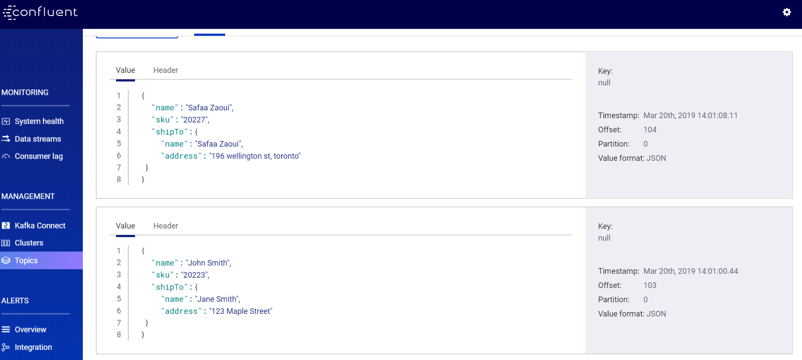

# KafkaCat 

### :one: Créer son environnement dans son repertoire :

* Copier le fichier de docker-compose.yml d'apres le repertoire D.Demo.

```
$ cp ../../D.Demo/docker-compose.yml  . 
```

* Enlever les applications de musique

```
$ nano docker-compose.yml
```

* Avant de l'executer dans 1.Kafkacat/ID vous devez supprimer votre environnemnet  dans D.Demo

```
$ cd ../../D.Demo
$ docker-compose stop 
$ docker-compose rm 
```
### :two:  Executez votre environnement dans 1.KafkaCat/ID :

```
$ cd ../../1.KafkaCat/ ID   
$ docker-compose up -d 
```

* Connaitre le nom de switch Docker de KafkaCat

```
$ docker network ls
```

* Faire la liste de tout l'environnment

```
$ docker run --tty --network 300108495_default confluentinc/cp-kafkacat kafkacat -b kafka:29092 -L
```

### :three: Création de Topics :

* Accédez à votre base de Kafka

```
$ docker-compose exec kafka bash 
```

* Création de Topics

```
root@kafka:/# kafka-topics --zookeeper zookeeper:32181 --topic clients_info --create \
               --partitions 3  --replication-factor 1
Created topic "clients_info".

root@kafka:/# kafka-topics --zookeeper zookeeper:32181 --topic products --create \
                 --partitions 3  --replication-factor 1
Created topic "products".
```

### :four: Création de fichier JSON :

* Vous devez revenir à votre path Develper/INF1069../1.KafkaCat/ID
et vous créez un fichier de json 

```
$ nano client1.json 
```

* Ajoutez ce code

```

{ "name"   : "John Smith", "sku"    : "20223", "shipTo" : { "name" : "Jane Smith", "address" : "123 Maple Street" }}

```
Et vous pouvez ajouter les autres fichier de client$.json avec un de ces lignes 
```
{ "name"   : "Frank lil", "sku"    : "20224", "shipTo" : { "name" : "Frank", "address" : "154 Webster" }}
{ "name"   : "Lele Pos", "sku"    : "20225", "shipTo" : { "name" : "LeLe", "address" : "18 jane" }}
{ "name"   : "John Smith", "sku"    : "20226", "shipTo" : { "name" : "Jane Smith", "address" : "123 Maple Street" }}
{ "name"   : "Safaa Zaoui", "sku"    : "20227", "shipTo" : { "name" : "Jessi", "address" : "19 George Webster" }}
{ "name"   : "Amelie Dubois", "sku"    : "20228", "shipTo" : { "name" : "Amelie", "address" : "18 jane" }}


```
Et la même chose pour le fichier de product$.json
```
{ "name"   : "Scarf", "sku"    : "20223", "ticket" : { "price" : 25 , "product_date" : 1553708324000}}
{ "name"   : "pants", "sku"    : "20224", "ticket" : { "price" : 56 ,"product_date" : 1553089124000}}
{ "name"   : "shirt", "sku"    : "20225", "ticket" : { "price" : 13 , "product_date" : 1551533924000}}
{ "name"   : "dress-pinky", "sku"   : "20226", "ticket" : { "price" : 189.78 , "product_date" : 1553708324000}}
```

## :five: Création des jeux.sh :

Il faut créer des jeux.sh pour chaque topic 

pour clients_info

```
$ nano jeu1.sh

```
Et vous tappez ce code :
```
#!/bin/bash

function main {
   echo "Copy de fichier "
   for client in ./client*.json; do
        
        docker exec --interactive kafka kafka-console-producer --broker-list kafka:9092 --topic clients_info < ./client$.json
     
done
}

main
```
*  même chose pour le topic de product :
```
$ nano jeu2.sh
```
et taper ce code

```
#!/bin/bash

function main {
   echo "Copy de fichier "
   for product in ./product*.json; do
  
        docker exec --interactive kafka kafka-console-producer --broker-list kafka:9092 --topic products < ./product$.json
 done
}

main
```
afin de tester votre fichier de json vous devez juste faire :

```
$ sh jeu*.sh
Copy de fichier
>>>>>>>>>>>>>>>>>>>>>>>>>>>>>>>>>>>>>>>>

```

* Pour voir le resultat vous pouvez voir dans le site http://10.13.237.13:9021/management/clusters

pour Clients_info


pour Products


### :six: Création d'un nouveau Stream :

* Il faut aller premièrement au KSQL Bash :

```
$ docker-compose exec ksql-cli ksql http://ksql-server:8088 
```

* Création d'un nouveau Stream du topic `clients_info` 
 

```
ksql> CREATE STREAM ksql_clientsinfo \
      (NAME STRING, SKU BIGINT, \
      SHIPTO STRUCT< NAME STRING, ADDRESS STRING>) \
      WITH (KAFKA_TOPIC='clients_info', VALUE_FORMAT='JSON');
      

 Message
----------------
 Stream created

```

* Pour voir tous  les info des clients :

```
ksql> SELECT * FROM ksql_clientsinfo ;

1553104904755 | null | John Smith | 20223 | {NAME=Jane Smith, ADDRESS=123 Maple Street}
1553104908552 | null | Lele Pos | 20225 | {NAME=Amelie, ADDRESS=18 jane}
1553104912303 | null | Safaa Zaoui | 20227 | {NAME=Safaa Zaoui, ADDRESS=196 wellington st, toronto}
1553104897173 | null | Lele Pos | 20225 | {NAME=Amelie, ADDRESS=18 jane}
1553104918027 | null | Frank lil | 20224 | {NAME=Jessi, ADDRESS=154 Webster}
1553104869991 | null | Amelie Dubois | 20228 | {NAME=Amelie Dubois, ADDRESS=65 gorgia victoria street }

```

* ALors pour Décrire ce stream :

```
ksql> DESCRIBE ksql_clientsinfo;

 Field   | Type
-----------------------------------------------------------------
 ROWTIME | BIGINT           (system)
 ROWKEY  | VARCHAR(STRING)  (system)
 NAME    | VARCHAR(STRING)
 SKU     | BIGINT
 SHIPTO  | STRUCT<NAME VARCHAR(STRING), ADDRESS VARCHAR(STRING)>
-----------------------------------------------------------------

```

#### :seven: Créer une table d'apres le topic products :

* Premièrement on va creer un Stream qui s'appelle ``` ksql_products``` afin qu'on détermine tous les colonnes :

```
ksql> CREATE STREAM ksql_products \
     (NAME STRING, SKU BIGINT ,TICKET STRUCT< PRICE BIGINT, PRODUCT_DATE BIGINT>) \
      WITH (KAFKA_TOPIC='products',VALUE_FORMAT='JSON');
      
       
 Message
----------------
 Stream created       
```
* Montrer les colonnes de Stream :

```
ksql> SELECT NAME, SKU, TICKET->PRICE, TIMESTAMPTOSTRING(TICKET->PRODUCT_DATE, \
       'yyyy-MM-dd HH:mm:ss') FROM ksql_products;


Scarf | 20223 | 25 | 2019-03-26 13:35:08
Braclet | 20224 | 35 | 2019-03-12 13:35:08
T-shirt | 20228 | 40 | 2019-03-16 13:35:08
Long-Pants | 20225 | 75 | 2019-03-26 13:35:08
Dress-Pinky | 20227 | 89 | 2019-03-02 13:35:08
Scarf | 20223 | 25 | 2019-03-26 13:35:08
Braclet | 20224 | 35 | 2019-03-12 13:35:08
Long-Pants | 20225 | 75 | 2019-03-26 13:35:08
Dress-Pinky | 20227 | 89 | 2019-03-02 13:35:08
T-shirt | 20228 | 40 | 2019-03-16 13:35:08

```

* Création de stream ```products_with_key ``` avec un nouveau topic ```products-with-key ```  partition  par ID et avec Format ```Avro ``` :

```
ksql> CREATE STREAM products_with_key \
         WITH (VALUE_FORMAT='AVRO', KAFKA_TOPIC='products-with-key') \
         AS SELECT NAME, CAST(SKU AS STRING) AS ID, TICKET->PRICE, TICKET->PRODUCT_DATE \
         FROM ksql_products PARTITION BY ID;
         
 
 Message
----------------------------
 Stream created and running

```

* Et finalement on crée la table d'après le topic ``` products-with-key``` :

```
ksql> CREATE TABLE ksql_products_table \
      WITH (VALUE_FORMAT='AVRO', \
      KAFKA_TOPIC='products-with-key', KEY='ID');
      
      
  Message
---------------
 Table created
---------------


```

* Pour voir tous les infos de cette table :

```
ksql> SELECT * FROM ksql_products_table;

1553708750703 | 20225 | Long-Pants | 20225 | 75 | 1553708324
1553708754537 | 20227 | Dress-Pinky | 20227 | 89 | 1553708324
1553708748742 | 20224 | Braclet | 20224 | 35 | 1553708324
1553709673819 | 20227 | Dress-Pinky | 20227 | 89 | 1553708324
1553711811611 | 20223 | Scarf | 20223 | 25 | 1553708324
1553711813625 | 20224 | Braclet | 20224 | 35 | 1553708324
```


## Jointure entre Stream et la table :

* Pour faire la jointure entre le Stream ``` ksql_clientsinfo```et La table ``` ksql_products_table``` :

```
ksql> SELECT CI.name, PR.name, CI.sku, PR.ticket__price \
       FROM ksql_clientsinfo CI JOIN ksql_products_table PR \
       ON  PR.id = CI.sku;

         
         
Lele Pos | Long-Pants | 20225 | 75
Frank lil | Braclet | 20224 | 35
Safaa Zaoui | Dress-Pinky | 20227 | 89
Frank lil | Braclet | 20224 | 35
Lele Pos | Long-Pants | 20225 | 75
Adelle Lion | Long-Dress | 202210 | 50
John Smith | Scarf | 20223 | 25
Frank lil | Braclet | 20224 | 35
Lele Pos | Long-Pants | 20225 | 75
Safaa Zaoui | Dress-Pinky | 20227 | 89
Amelie Dubois | T-shirt | 20228 | 40
Brice Robert | Shirt | 20229 | 20
Adelle Lion | Long-Dress | 202210 | 50


```

### Suppression d'un stream qui est relié à une table : 
 
Si vous voulez supprimer une table mais ca vous montre erreur donc vous devez faire les etapes suivants :

* Voici l'erreur
```
ksql> drop table products;
Cannot drop PRODUCTS. 
The following queries read from this source: [CSAS_REPAS_WITH_KEY_3]. 
The following queries write into this source: []. 
You need to terminate them before dropping PRODUCTS.
```

* ALors il faut faire dabord :

```
ksql> show queries;

 Query ID              | Kafka Topic    | Query String                                                                                                                                                                                                                                          
------------------------------------------------------------------------------------------------------------------------------------------------------------------------------------------------------------------------------------------------------------------------------------------------
 CSAS_PRODUCTS_WITH_KEY_1 | PRODUCTS_WITH_KEY | CREATE STREAM products_with_key    WITH (VALUE_FORMAT='AVRO',     KAFKA_TOPIC='repas_with_key') 
------------------------------------------------------------------------------------------------------------------------------------------------------------------------------------------------------------------------------------------------------------------------------------------------
For detailed information on a Query run: EXPLAIN <Query ID>;
```

* à ce niveau il faut prendre le Id  de ``` QUERY ID ``` et le terminer comme cette commande :

```
ksql> terminate  CSAS_PRODUCTS_WITH_KEY_1;

 Message           
-------------------
 Query terminated. 
-------------------
```
* et apres il faut supprimer le stream "with_key" :

```
ksql> drop stream products_with_key;

 Message                             
-------------------------------------
 Source PRODUCTS_WITH_KEY was dropped.  
-------------------------------------
```
* et finallement supprimer la table ```PRODUCTS ``` : 

```
ksql> drop table products;

 Message                         
---------------------------------
 Source PRODUCTS was dropped.  
---------------------------------
```

:exclamation: Si vous avez un problème concernant la partition du Topic que " un a 4 et l'autre a 3 " donc la solution vous devez supprimer le topic que vous avez crée  avec 3 partition et le recréer avec 4 partitions :

```
$ docker-compose exec kafka bash 

root@kafka:/# kafka-topics --zookeeper zookeeper:32181 --topic products --delete

```
* maintenat on recree le meme topic mais avec 4 partitions :

```
root@kafka:/# kafka-topics --zookeeper zookeeper:32181 --topic products --create \
                 --partitions 4  --replication-factor 1
```
:innocent: Alors maintenant vous pouvez juste tester votre jointure et ca va sur marcher. 


