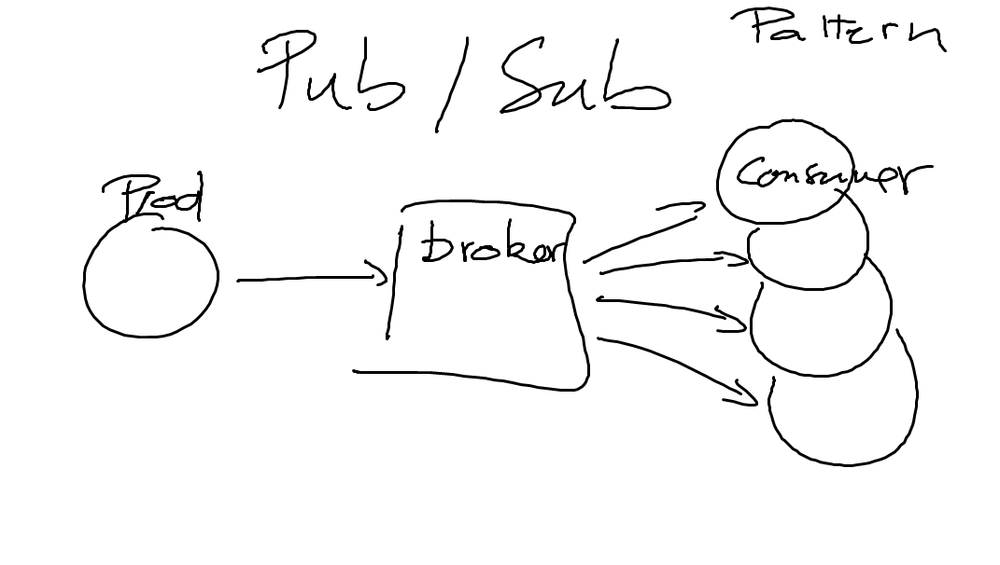
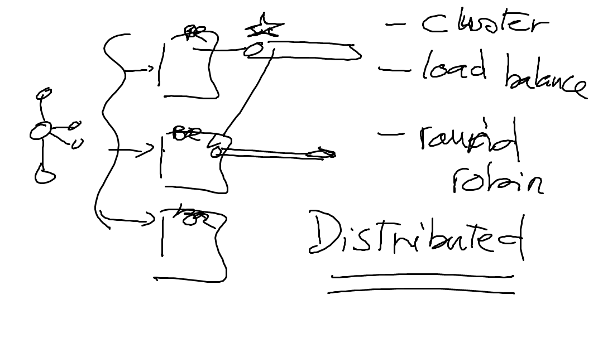
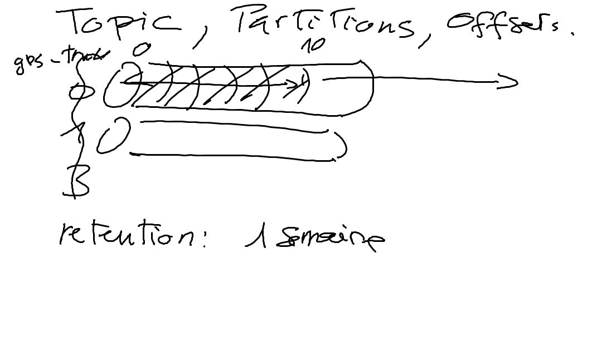

# Base 

## Equivalent d'un Message Broker

## Géré en grappes (Cluster)

## Géré en grappes (Cluster)

## Les Topics peuvent etre vu comme une table

## Les topics peuvent etre lus en groupes

## Les messages sont appellé offsets et contenu dans des fichier logs

